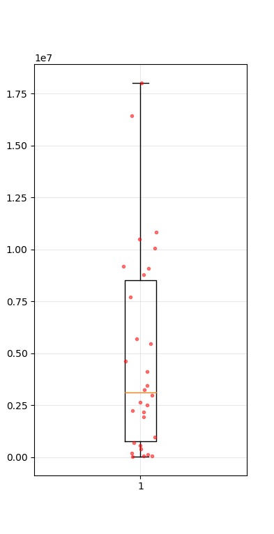
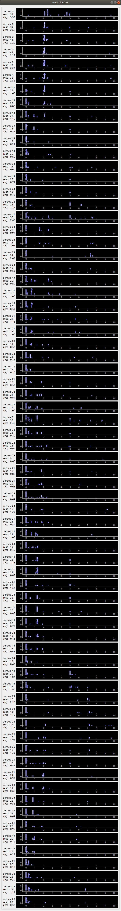
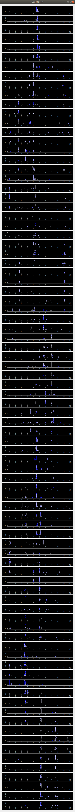
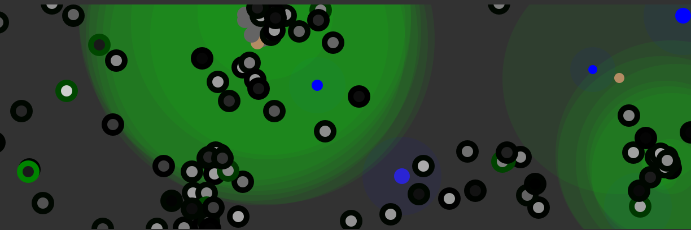

# Analysis

## Repo versions
- Version 1: https://github.com/zshimanchik/unconditioned-reflexes
- Version 2: https://github.com/zshimanchik/iron-unconditioned-reflexes
- Current: https://github.com/zshimanchik/animals  

### Мамонты: идея

Изначальная идея введения мамонтов, заключалась в том, чтобы попробовать сформировать у энималов поведение к кооперации.
Задумка в том, чтобы дать каждому энимало возможность самому производить запах (отличный от других обьектов), которым 
они могли бы коммуникацировать друг с другом. А в качестве стимула для развития коммуникации служил бы дополнительный 
обьект - "мамонт", который они не смогут есть в одиночку и с малым радиусом запаха, в сравнении потенциальным 
радиусом запаха самих энималов. Регуляция силы\радиуса (одно и тоже понятие) запаха энимала, конечно же брала бы на 
себя нейронная сеть. Выглядело бы это так, что когда особь энимала случайно приближалась бы к мамонту, нейронная сеть
начинала бы издавать сильных запах, на который бы слетелись другие энималы. Естественно, реакция к тому, чтобы идти
на запах другого энимала тоже должа была бы развиться.

Как оказалось, добиться такого поведения было очень сложно. В тот момент этот дневник еще не вёлся, поэтому деталей нет.
Видимо, чтобы снизить нагрузку на вычисления и попробовать добиться желаемого результата постепенно запах энималов был 
удалён. Поведение, которое анализировал в таком случае, заключалось в том, чтобы энималы в первую очередь стремились к
обычной пище, а во вторую очередь к мамонту. Чего в последствии удавалось достичь, но интерес привлекал, видимо, 
как и почему это поведение возникало.

#### 1e0cd22 repo:iron-unconditioned-reflexes

Мамонты появляются лишь на половине экрана, что должно создать надёжную зону для выживания.

Запись 1

Иногда, у некоторых особей было нужное поведение: крутиться около мамонта, но при пище стремиться к ней. Но одновременно
так случалось только у пары особей и мамонта они не валили ибо были одиноки и наедине с мамонтом умирали. К тому же 
кажется что нету стимула для того, чтобы валить мамонта, ибо еды хватает, но в то же время эта запись кончилась тем, что
остались одни девочки, а мальчики умерли. Т.к. запись кончилась досрочно на 286000 цикле, запахи еще не включились и 
проанализировать их сигналы не было возможности.

Идеи для решения проблемы: увеличить ширину мира,  чтобы зоны с мамонтами и без были более изолированы и энималам было 
сложнее перескочить из одной в другую.  Кроме того, уменьшить вероятность появления пищи в зоне с мамонтами. Таким 
образом получим одну благоприятную зону для поддержания численности агентов и другую зону, со стимулом к эволюции в 
интересующую сторону для нас.

Запись 2

Мамонты скучковались и их было сложно завалить. Ибо бегая рядом энималы валили то одного, то другого. Иногда попадались 
такие особи которые реалировали на мамонтов и зависали возле них, но не находя поддержки в частых услучаях они так и 
умирали, но пару раз всё-таки по воле случая мимо проходили другие энималы и валили мамонта, после чего все ближайшие 
энималы сбегались и ибыстро съедали что получилось.

#### d4d3439 repo:iron-unconditioned-reflexes

за 10 часов записи сменилось 16 миров. Не выживает первое поколение. Не равномерное было увеличение размера мира, 
количество старовой пищи и стартовая популяция энималов.

хм... это есть баг. food_timer работает не правильно, при увеличении  размера поля - еда появляется реже. Так что мало 
того, что увеличилась площать мира, так еще и пища стала реже появляться, а значит в этом моделировании были жестокие 
условия для существования.

- 1-4 миры - не выжило первое поколение
- 5 -  несколько особей кое-как выжило, за это время на поле накопилось достаточно много еды и в один момент случился 
взрыв численности в левой части мира, и все особи как саранча стала равномерно продвигаться в правую его часть. 
Опустошив полностью еда не успела восстановится и оставшейся пищи не хватило на выживание.
- 6 - некоторые особи сформировали хорошую реакцию достаточно рано и благодоря отдельным особям и удачному стечению 
обстоятельств мир продержался 60000 циклов. но условия всё равно были слишком жесткими.
- 7 - остлось пару особей которые заросли едой, но были далеко друг от друга. и из-за отсутствия изменений мир 
перезагрузился.
- 8,9 - не выжило первое поколение
- 10 - отсутствие изменений
- 11 -не выжило первое поколение
- 12 - ситуация похожая на 6 мир, но были попытки крутится около мамонтов. Но завалить не получилось из-за недолгого 
пребывания возле него, хотя особей было достаточно много.
- 13,14,15 - не выжило первое поколение
- 16 - мир выключен незавершенным.

Вывод: фиксить баг.

#### 822d59c repo:iron-unconditioned-reflexes

Чтож мир стал вполне стабильным. В левой части всегда благоприятная зона и популяция там всегда большая, в правой - 
наоборот, но есть мамонты. за 400 000 циклов было много убийств мамонтов, но я по моему мнению они были в основном 
случайны, либо  не вызымели продолжения, из-за того, что условия в целом неблагоприятные, даже те особи, которые 
собирались у мамонта после съеданые пищи из него в скором времени умирали. возможно просто не хватило времени чтобы 
эволюция свершилась. зато много случаев было, когда две особи достаточно много времени проводили около мамонтов, может 
стоит сделать возможность двум особям убивал мамонта? а возможно стоит усилить запах энималов, чтобы они могли дальше 
сообщать. сейчас я испытываю большой дискомфорт в записывании моделирования мира. ибо я не могу что0то еще делать за 
компом пока оно включено.

#### d59c4ec repo:iron-unconditioned-reflexes

Возможно стоило бы добавлять новых мамонтов подальше от существующих, чтобы не образовывалось групп, которых сложно 
завалить. Значения MAMMOTH_BEAT_VALUE и MAMMOTH_REGENERATION_VALUE считаю приемлимыми.  и возможно для того, чтобы они 
эволюционировали нужно больше времени. Но эта запись заняла 9 часов на ~225000 циклов. стоит либо увеличить 
производительность, либо создать запись мира, что более желательно.

#### 47db711

Переписал на CPython + qt. Даже не оптимизируя, в один поток она работала также быстро как в три на IronPython. Однако 
тут уже оптимизировав код используя библиотеку numpy, добился перформенса в пять раз быстре, чем в три потока 
IronPython, а используя некоторые уловки и в десять. Но при этом можно запускать 3 инстанса программы одновременно 
(т.к. имею 3 ядра).

Поставив на ночь на запись в формате mkv три окна программы, у меня кончилось место на диске, а было свободно 5.7GB. 
самый старый мир дошел до 786000 цикла. Но требуемого поведения не наблюдается. Иногда, получалось так, что большой 
кучей энималы собирались вокруг мамонтов и валили их. Но сложно сказать достаточное ли было поощрение за это поведение. 
Смогли ли они создать потомство на ту энергию, что получили. Кажется что нет. К тому же остальной еды достаточно много, 
чтобы они могли не заморачиватся мамонтами.

Следует уменьшить количество еды, и возможно уменьшить дисперсию появления её, чтобы условия в правой части были еще 
жёстче.

#### dbf57c2

Кажется слишком малое поощрение за мамонта.

#### 7ae473d food-and-mammoths

Несколько раз запускал моделирование. Один раз на 300 000 цикле они реагировали на мамонтов и большой стайкой охотились 
за ними, но в первую очередь поглощали еду, а уже потом бежали к мамонтам. Однако повторить эту эволюцию не получилось 
уже несколько раз запускал моделирование, когда мир доходил до 1 500 000 цикла, но подобного поведения больше не 
формировалось. Следует запустить еще несколько раз.

Но по наблюдениям за миром можно сказать, но на начальных этапах, рождаться с отклонением, при котором стремишься к 
мамонту не выгодно, ибо одного энимала не достаточно чтобы завалить мамонта, и в итоге эта особь умирает в одиночестве 
рядом с мамонтом.

#### 77ad2bd food-and-mammoths

- мир 1, макс цикл = 2 000 000, реакция - есть. Зачатки поведения, стремящегося к мамонтам во вторую очередь после еды, 
появились на 300 000 цикле, и до 600 000 оставались невыраженными, и на 700 000 уже произошёл какой-то качественный 
скачок в их поведении, они стали стремится к мамонтам и численность населения в правой части экрана резко возросла, с 
поведение в точности от них ожидаемым.
- мир 2, макс цикл = 2 100 000, реакция - нет.
- мир 3, макс цикл = 2 100 000, реакция - нет.

Возможно стоит добавлять циклы зимы-лето. в правой части большую часть времени находятся энималы, которые более или 
менее приспособлены к жизни в ней и так или иначе обладают зачатками нужного поведения. и возможно стоит позволить им 
создать потомство для рекомбинации генов. Для этого улучшить условия и добавлять пищу чаще, а после этого вновь 
ужесточить.

Предположения по поводу того, как могло возникло необходимое поведение:
1. Энимали в левой части сцены, совершенно случайно стали обладать генами, которые позволяют им стремится к мамонтам во 
вторую очередь после еды. Учитывая малый размер нейронной сети, это не так невероятно.
2. Второй - особям в правой части, которые более или менее присоблены к ней, повезло им досталось много еды и они 
наделали потомства со своими генами.

#### ef9dee7 food-and-mammoths

Добавил циклы зима-лето

- мир 1, длительность года = 20 000, макс цикл = 500 000,  реакция - есть. на 200 000 была. признаки на такое поведение 
появились уже на 100 000 цикле
- мир 2, длительность года = 40 000, макс цикл = 590 000, реакция - нет
- мир 3, длительность года = 80 000, макс цикл = 570 000, реакция - нет
- мир 4, длительность года = 20 000, макс цикл = 1 300 000, реакция - нет
- мир 5, длительность года = 40 000, макс цикл = 1 200 000, реакция - нет
- мир 6, длительность года = 80 000, макс цикл = 1 300 000, реакция - есть. на 1 280 000 была (какая-то не стабильная). 
Могла раньше признаков  не было. однако загрузившись с 1 160 000 возникала вновь.

#### 674daf3 food-and-mammoths

Должно быть аналогично 77ad2bd - т.е. без циклов зима-лето.

Из шести запусков до 900 000 цикла, реакция сформировалось у двух. видимо, циклы зима-лето не играют роли.

#### 674daf3 food-and-mammoths

Продолжив вычисления на тех же мирах. реакция появилась еще у нескольких миров.

1 - есть, 2 - нет, 3 - есть, 4 - нет, 5 - есть, 6 - есть

Вопрос только как она сформировалась, ибо на последних циклах, в правой части очень много энималов и они валят мамонтов 
автоматически, из-за этого не видно есть ли у них вообще какая-то реакция на запах мамонтов.

#### 4bee79f6 master

Разница с веткой `food-and-mammoths` в том, что раньше размер карты был в два раза больше и сила запаха мамонтов была 
гораздо мощнее:

```
WORLD_HEIGHT = 400
MAMMOTH_SMELL_SIZE_RATIO = 29.0
```

При следующих параметрах поведение стремления к мамонтам во вторую очередь формируется довольно великовероятностно.

```
self.MAMMOTH_BEAT_VALUE = 0.007
self.MAMMOTH_REGENERATION_VALUE = 0.01
```

После того как это поведение сформировано можно усложнить добычу мамонта и они всё равно будут продолжать это делать,
однако если сразу поставить сложные условия добычи мамонтов, то формирование поведения усложниться.  

```
self.MAMMOTH_BEAT_VALUE = 0.003
self.MAMMOTH_REGENERATION_VALUE = 0.005
```

Пока ничего конкретного, но вопрос заключается в том: а как сложно сформировать это поведение? какие условия должны быть
для успешного формирования? Возможно это холм в ландшафте поведения вырос в связи с изменениями этих параметров.

Тогда встаёт вопрос, может ли быть ландшафт на который невозможно вскарабкаться? (Крайне маловероятно добраться за 
приемлимый промежуток времени). И значит ли это, что для сложной горы в ландафте поведения должна всегда быть какая-либо
"тропинка", которая ведёт на гору? Может быть с некоторыми "порогами" на которые будет тратиться значительное время.

Возможно было бы интересно запустить несколько симуляций с "сеткой" параметров, чтобы составить этот ландшафт 
веротяности формирования поведения.

#### b35a0f02 master

Запустил 30 эмуляций с максимальной продолжительностью 1 000 000 итераций. С индикацией достижение >0.01 убийств 
мамонтов за один тик (считается среднее за 2000 итераций). Ожидаемой реакции достигли 7 миров из 30, в остальных мирах 
реакция так и не была достигнута на 1 000 000 итерации.

- World world_n6 got reaction at 38355
- World world_n8 got reaction at 15690
- World world_n17 got reaction at 87638
- World world_n19 got reaction at 478425
- World world_n23 got reaction at 267961
- World world_n27 got reaction at 55944
- World world_n29 got reaction at 70599

Примечательным и неожиданным фактом является очень раннее образование этой реакции! Могу предположить что так получается
из-за того, что они очень сильно "натренированы" на еду, а она появляется довольно часто в области с мамонтами. 

К тому же реакция образуется не наверняка и не стабильно, что затрудняет "составлении сетки".

#### f69939e7 master

Запустил 30 эмуляций с максимально продолжительностью 5 000 000 итераций. C такой же целью, как в прошлый раз.
До 1 000 000 итераций достигли 8 миров, до 5 000 000 интераций 19 миров достигли нужного поведения.

Обновление **072d311**: Продолжил вычисление миров, что не достигли нужного поведения за 5кк итераций, **все 30 
миров** достигли этого поведения. Обновил список.

- World world_n6  got reaction at 32 595
- World world_n9  got reaction at 50 401
- World world_n4  got reaction at 74 895
- World world_n1  got reaction at 146 610
- World world_n7  got reaction at 188 333
- World world_n17 got reaction at 412 591
- World world_n29 got reaction at 550 933
- World world_n14 got reaction at 714 961
- World world_n25 got reaction at 972 465
- World world_n0  got reaction at 1 950 433
- World world_n10 got reaction at 2 192 841
- World world_n21 got reaction at 2 235 433
- World world_n15 got reaction at 2 524 155
- World world_n24 got reaction at 2 645 035
- World world_n22 got reaction at 2 987 927
- World world_n2  got reaction at 3 268 790
- World world_n16 got reaction at 3 461 027
- World world_n19 got reaction at 4 125 106
- World world_n3  got reaction at 4 624 136
- World world_n27 got reaction at 5 483 442
- World world_n28 got reaction at 5 710 481
- World world_n11 got reaction at 7 718 059
- World world_n5  got reaction at 8 788 360
- World world_n13 got reaction at 9 077 027
- World world_n20 got reaction at 9 193 164
- World world_n8  got reaction at 10 049 096
- World world_n26 got reaction at 10 509 236
- World world_n23 got reaction at 10 822 015
- World world_n18 got reaction at 16 446 545
- World world_n12 got reaction at 18 028 088

Среднее: 4 832 806
Медиана: 3 128 358




### Мамонты: вывод

Стоило больше фокусироваться на оригинальной идее - коллаборации, в процессе работы она была призабыта. Однако, 
вспыл и стойко присутствует даже сейчас более общий и фундаментальный вопрос: а как изменение отдельного параметра 
влияет на всё моделирование в целом? Примером не связанным с мамонтами является взаимосвязь следующих параметров: 

- FOOD_TIMER
- APPEAR_FOOD_COUNT
- APPEAR_FOOD_SIZE_MIN
- APPEAR_FOOD_SIZE_MAX
- WORLD_HEIGHT

Вопрос, который возникал чаще всего: при увеличении размера поля, какие величины следует увеличить? FOOD_TIMER или 
APPEAR_FOOD_COUNT? Например, в одном случае энималом было бы выгоднее бегать быстрее, а в другом стоять на месте и 
ждать, пока еда сама появится. Это интересный вопрос для исследования и запила, весьма полезный.

В целом идея коллаборации энималов воплощена не была. Ретроспективно оцения подход: альтернативно, можно было бы не 
создавать много еды, после смерти мамонта, а давать еду напрямую из мамонта, если его одновременно бьют несколько 
особей. Возможно, можно было бы давать тем больше энергии, чем больше его бьют одновременно.

Но спасибо эгоистичному гену Ричарда Докинза у меня появилась новая интересная идейка, зачатки которой уже появлялись, 
но, в свете книги, приобрели новые краски.


### Половая дивергенция

Смоделировать данное явление натолкнула книга Ричарда Докинза "Эгоистичный ген" в главе, связаной с образованием полов,
В ней утверждается, что расхождение полов, является эволюционно стабильной стратегией. Представив, что все особи дают 
вклад энергии поровну, ровно столько сколько необходимо, если вдруг одна особь станет давать больше чем надо, это значит
что другие могут воспользоваться этим и давать меньше, имея возможность осеменить большее количство особей. Однако те, 
кто останутся посередине, не будут обладать ни преимуществом частого осеменения, ни большим количеством энергии.

Задача состоит в том, чтобы переделать моделирование и, вместо того, чтобы отнимать у родителей и давать детям 
константное значение энергии, добавить в ДНК подпоследовательность кодирующую значение energy_for_birth, которое будет
отниматся при родах и передаватся ребёнку. У каждого родителя своя переменная, которая отнимается от их энергии, и 
переменные обеих родителей суммируются при передаче ребёнку. 

#### 5b6027ea

Иногда дивергенция ярко выраженная, иногда нет, иногда они вновь сходятся к среднему значению. Даже после того, как они
сильно разошлись и самок и самцов (самки - те кто даёт много энергии детя, самцы - мало) было примерно поровну,
через некоторое время всё сошлось к центру. Мне кажется, что тут большое значение имеет эффект основателя. Т.к. сейчас
значение закодировано в днк в виде 4-значного числа с основанием 4, например 3213, и преобразуется в int от 0 до 255 
наибольшее значение имеет старшая цифра, которая имеет множитель 64, лишь изменение этой цифры достаточно.
Однако это также кроет в себе большую опасность в том, что случайное изменение этой цифры, может легко закрепиться. 
Возможно он «не успевает ощутить» штраф за отклонение... Как доказать, что это расхождение не случайность?

Попробую увеличить расстояние Левенштейна между днк строк, что отвечают за числовыми крайностями в параметре.

#### 2e4134f7

Это был сраный баг! Баг пофикшен, пока, оставил кодирование старым образом. Также ввёл бесполезный параметр, чтобы 
можно было сравнить его распределение с распределением energy_for_birth. Однако стоит подумать над тем, как 
математически это сделать, боюсь что распределение у него будет не нормальное и самые популярные алгоритмы сравнения 
выборок тут не прокатят.

#### 62948fdd

Это работает! Запустил 4 мира без ограничения по времени, за ночь дошли до 7.7кк, 8.1кк, 8.6кк, 7.1кк итераций. 
Все миры начинали со среднего значения гена кодируюшего значение 5 при 0 минимум, 10 максимум.
В трёх мирах за 800к итераций некоторые особи обрели значение 0 (в последнем мире за 1500к итераций). После чего 
это значение закрепилось и оставалось до самого конца. Среднее значение по параметру, также стремились к нулю, но иногда
колебалось. После достижения стабильного состояния Соотношения количества особей со значением 0 и не 0 составляло 
примерно 50%.

Для анализа был разработан дополнительный иструмент, графики показаны ниже. Также для примера приведёт график 
бесполезного параметра, который ни на что не влияет.

Energy for birth distribution



Useless param distribution



Стоит также отметить, что "нули" и "около-нули" создавали очень много детей, которые очень быстро умирали, однако у них
был шанс выжить, если их родили в близости от пищи и они успевали достаточно насытиться.

**Вывод:** Чтож, если классифицировать энималов на тех кто вносит 0 энергии и тех кто вносит не 0 энергии, мы действительно можем 
увидеть здесь дивергенцию. Не вносить энергию в своих детей крайне эффективная стратегия, позволяющая, совокупится с 
множеством особей, поэтому вся популяция стремится к этой величине. Однако, кто-то же должен давать эту энергию, хотя бы
необходимый минимум, поэтому в популяции всегда есть такие особи. И отношение количестве между ними 50% на 50%. В целом
считаю подтверждение теории успешной. Однако возник вопрос, при строгом отношении к этому необходимо доказать, что 
такое распределение возникло не случайно. Для меня это открытый вопрос, т.к. никак не притянешь это к банальному 
нормальному распределению с хорошо известными алгоритмами сравнения. Возможно на мысль натолкнёт анализ генеалогического
древа. Однако технически это требует доработки.


## Снова мамонты

Вернулся к идее заставить их коммуникацировать, чтобы они вместе валили мамонтов. С тех пор как я понял что все миры 
рано или поздно эволюционируют к этому, я решил все таки усложнить задачу и попробовать это.

### fc5b55e1 & 571a7bf1

Добавил возможность энималам пахнуть. Запах мамонтов сильно сократил. В отличии от предыдущих версиях тут также 
сохранилась половая дивергенция на уровне ДНК, поэтому зачустую энималы делают много детей. 
Важная деталь в том, что энималы также чувствуют свой же запах. Нейронная сеть усложнилась и ее размер стал: 9х2х3
Не считая нейронов байеса. Хм. Я  только что подумал, не нужно ли сделать второй слой размером в 3, иначе как они 
смогут передать всю информацию на следующий слой? А вообще наверно можно было бы размер скрытого слоя занести в ДНК.
Результат: 7 миров

- world_201120_fc5b55e_01 2_000_000 
- world_201120_fc5b55e_02 2_000_000 
- world_201120_fc5b55e_03 1_800_000 
- world_201120_fc5b55e_04 2_000_000 
- world_201120_fc5b55e_05 1_900_000
- world_201120_571a7bf_06 1_300_000
- world_201120_571a7bf_08 1_400_000

Ни в одном из них они не начали охотится на мамонтов, и во всех они всегда выделяли свой запах и не обращали на него 
внимания, хотя иногда она кружились вокруг других особей.
Гипотезы: 
1. Скрытый слой слишком мал и не передает всей информации.
2. Из-за того, что они просто так все время источают запах, они начинают его игнорировать, можно добавить небольшой 
штраф на запах. Так они будут источать его только когда это действительно нужно.
3. Запах мамонтов слишком маленький, так что меньше шансов, что они начнут крутится вокруг него.
Идея: увеличить размер скрытого слоя
Но по хорошему надо было бы им дать больше времени, потому как даже в предыдущих запусках они достигали реакции на 
3 млн в медиане. Но скорость вычисления ограничена CPU в GCE VM, 

### 07d07e8

Изменил нейронную сеть на размер: 8х4х3. В некоторых мирах поведение стало более интересным, например, они замирают, 
когда нет еды. Такого раньше не происходило.
Добавил расход энергии на запах и сделал отсутствие запаха более простым: нейронная сеть отвечает в диапазоне [-1:1],
если величина <0 , то запаха не будет, а если больше , то будет. Однако это не особо повлияло на их поведение.
Может это баг, но сложно проверить это.

В итоге, все миры ниже не заимели ожидаемого поведения.

- world_201121_07d07e8_01 - 4_400_000
- world_201121_07d07e8_02 - 4_700_000
- world_201121_07d07e8_03 - 4_750_000
- world_201121_07d07e8_04 - 5_000_000
- world_201121_07d07e8_05 - 3_900_000
- world_201121_07d07e8_06 - 3_650_000
- world_201121_07d07e8_07 - 3_150_000
- world_201121_07d07e8_08 - 3_600_000
- world_201121_07d07e8_09 - 5_000_000
- world_201121_07d07e8_10 - 4_000_000
- world_201121_07d07e8_11 - 2_050_000
- world_201121_07d07e8_12 - 4_500_000
- world_201121_07d07e8_13 - 2_950_000
- world_201121_07d07e8_14 - 4_500_000
- world_201121_07d07e8_15 - 4_800_000

Нужно добавить минимум энергии, который родители должны израсходовать впустую, чтобы родить детей. Потому что сейчас
Они отдают 0 энергии детям и расходуют 0. Это приводит к тому, что иногда два нуля встречаются и плодят кучу детей,
которые сразу же умирают. Все бы ничего, но это сильно влияет на производительность.
И мне кажется стоит повычислять дольше. (UPD: повычислял и обновил таблицу выше)
Мне кажется, я сильно усложнил ступеньку на которую им нужно забраться за раз. Если раньше им нужно было просто начать 
реагировать на запах мамонтов и идти на него, то сейчас этот запах очень сложно заметить, потому что он не 
распрастраняется далеко. Возможно если бы они сначала научились охотиться на мамонтов, а потом "просить о помощи", 
то это было бы две ступеньки поменьше. С другой стороны, чему меня научили предыдущие симуляции, так это тому, что 
если им что-то сложно сделать, не значит, что это невозможно, а значит что им нужно больше времени, чтобы произошел 
случай.  


### 177bfe83 & 25aad1db

Добавил ENERGY_FOR_BIRTH_WASTE, которую энимал обязан израсходовать в пустую, чтобы родить детей. Это значение не 
передается ребёнку. Интересно, что величины, которые они отдают детям изменились! Теперь это больше не 0, теперь все
в той или иной мере дают детям энергию, чтобы их ENERGY_FOR_BIRTH_WASTE не был напрасен. Но анализировать это я сейчас
не стану. Вот список новых вычисленных миров.

| World                   | Max tick|
| :---------------------- | :------ |
| world_201122_25aad1d_01 | 5700000 |
| world_201122_25aad1d_02 | 5600000 |
| world_201122_25aad1d_03 | 5700000 |
| world_201122_25aad1d_04 | 5700000 |
| world_201122_25aad1d_05 | 5600000 |
| world_201122_25aad1d_06 | 5000000 |
| world_201122_25aad1d_07 | 5000000 |
| world_201122_25aad1d_08 | 5000000 |
| world_201122_25aad1d_09 | 5000000 |
| world_201122_25aad1d_10 | 5000000 |

Проблема с вычислениями решена, они больше не штампуют детей чрезмерно много. Но и поведения кооперации у них не 
возникло...

Однако это был БАГ! Вместо того, чтобы написать 

`self.energy -= max(0, self.answer[2]) * self.world.constants.ENERGY_FOR_SMELL_RATIO`

я написал

`self.answer -= max(0, self.answer[2]) * self.world.constants.ENERGY_FOR_SMELL_RATIO`

Таким образом, это дополнительно отнимало у ответа ходьбы и поворота значения, но не тратило энергию дополнительно.
По сути, это не должно было сильно повлиять на их поведение, просто дополнительный способ для них регулировать 
ходьбу и поворот. В основном они ходили задом, но в 1 из 10 миров, все таки передом. И стоит отметить, что хоть для них
и просто не пахнуть, т.к. половина диапазона ответа трактуется как не пахнуть, однако они во всех мирах его источали
и пользовались этим как дополнительным регулятором передвижения.

Сейчас пофиксим этот баг и посмотрим. Моя гипотеза в том, что они должны избегать ненужного источения запаха.

### 8448bfe

Пофиксил баг.

Пока не эволюционировали так как хотелось бы. Почти никто не пахнет теперь. Хотя валить мамонтов у них иногда приходит 
и уходит, запахом они не общаются, а из-за того, что мамонтов довольно мало и сложно их заметить, иметь такое 
поведение - хлопотное дельце.
Что можно сделать: 
1. Продолжать вычислять, рано или поздно случай должен проявится.
2. Может ли эта нейронка описать это поведение? Можно попробовать создать исскусственно.
3. Стабильное ли это поведение? Можно попробовать искусственно создать нейронку и запустить останется ли она в этом 
состоянии.
4. Как вариант, можно упростить им эту ступеньку, усилив запах мамонтов, но при этом медленно уменьшать его, если
они часто их валят.
5. Удлиннить поле, увеличить запах в центре, но уменьшить в отдаленной территории. Но это не очень честно? или нет. 
А погает ли то, что есть сейчас с тем, что еда слева, а мамонты справа? 
6. Убрать половое размножение. Или сделать доступным размножение самим с собой.

Половое размножение действительно под вопросом, сколько оно добавляет - вопрос.
Вычислял довольно долго:

| World name              | latest     |
| :---------------------  | :--------- |
| world_201123_8448bfe_01 | 9_400_000  |
| world_201123_8448bfe_02 | 9_950_000  |
| world_201123_8448bfe_03 | 9_900_000  |
| world_201123_8448bfe_04 | 10_000_000 |
| world_201123_8448bfe_05 | 10_000_000 |
| world_201123_8448bfe_06 | 9_200_000  |
| world_201123_8448bfe_07 | 5_000_000  |
| world_201123_8448bfe_08 | 10_000_000 |
| world_201123_8448bfe_09 | 9_150_000  |
| world_201123_8448bfe_10 | 9_200_000  |

Дополнительно увеличил параметр `MAMMOTH_SMELL_SIZE_RATIO` с 5 до 10, чтобы мамонты сильнее пахли. 
(Изменения не комитил)

| World name              | latest     |
| :---------------------- | :--------- |
| world_201123_cc771ba_00 | 12_400_000 |
| world_201123_cc771ba_01 | 10_900_000 |
| world_201123_cc771ba_02 | 11_600_000 |
| world_201123_cc771ba_03 | 11_600_000 |

На мой взгляд достаточно долго. Никто не заимел ожидаемого поведения.
Мне кажется, что ожидаемое поведение не достаточно устойчивое, то есть награда за него не достаточно велика, чтобы
окупить риски.
Собираюсь увеличить награду в три раза.

### cbfcff1

Изменил `FOOD_FROM_MAMMOTH_COUNT` с 5 на 15. 

| World name              | Latest tick |
| :---------------------- | :---------- |
| world_201124_cbfcff1_01 | 100_000     |
| world_201124_cbfcff1_02 | 400_000     |
| world_201124_cbfcff1_03 | 450_000     |
| world_201124_cbfcff1_04 | 200_000     |
| world_201124_cbfcff1_05 | 450_000     |
| world_201124_cbfcff1_06 | 100_000     |
| world_201124_cbfcff1_07 | 450_000     |

В 6 на 50_000, в 1 на 100_000, в 4 на 200_000 они начали валить мамонтов, не используя при этом свой запах.
Просто из-за того, что награды много их становилось много, они заполнили собой все поле и шанс, что они наткнутся на
мамонта большой и так. К тому же их слишком много, что плохо для вычислений, поэтому такая разница в длительности
вычислений.

Изменю-ка `FOOD_FROM_MAMMOTH_COUNT` с 15 на 10.


# 9ea5473

Изменил `FOOD_FROM_MAMMOTH_COUNT` с 15 на 10.

| World name              | Latest tick |
| :---------------------- | :---------- |
| world_201124_9ea5473_01 | 5_000_000   |
| world_201124_9ea5473_02 | 4_450_000   |
| world_201124_9ea5473_03 | 4_600_000   |
| world_201124_9ea5473_04 | 3_100_000   |
| world_201124_9ea5473_05 | 3_300_000   |
| world_201124_9ea5473_06 | 4_700_000   |
| world_201124_9ea5473_07 | 4_900_000   |

В 5ом и в 4ом мире на тике: 2_900_000 и на 3_000_000 все начали охотится на мамонтов, без использования своего запаха. 
В остальных мирах иногда возникают поведение стремления к мамонтом. Но не очень. 
Одно замечание в том, что мамонт пахнет очень слабо, а еда, которая вываливается из него очень сильно. Если в мире,
где поведения стремления к мамонтов не развито, то большой шанс умереть в одиночестве возле мамонта, а если ты 
двигаешься не останавливаясь на мамонтах, то у тебя больше нансов найти еду, однако когда мамонт умирает появляется
много еды, которую можно обнаружить и сьесть не прилая усилий по его убийству. Так получается, что "пиратсво" очень 
довольно выгодно, а охота довольно опасно.
Хотя когда в мире 5 они преступили какой-то порог, после которого все стремятся к еде, а потом к мамонту, и из-за их 
числа, а их становится много, когда они получают еду из мамонтов, они легко находят и валят мамонтов.



### 8228fb9

Изменил кластер, так, что я мог задавать изменения в константы и вычислять миры с разными константами одновременно.
Вот что получилось:

| World name                               | Latest tick | Constants changes                                              |
| :--------------------------------------- | :---------- | :------------------------------------------------------------- |
| world_201124_8228fb9_EFSR_0.0005         | 10_000_000  | {"ENERGY_FOR_SMELL_RATIO": 0.0005}                             |
| world_201124_8228fb9_EFSR_0.001          | 5_000_000   | {"ENERGY_FOR_SMELL_RATIO": 0.001}                              |
| world_201124_8228fb9_EFSR_0.005          | 5_000_000   | {"ENERGY_FOR_SMELL_RATIO": 0.005}                              |
| world_201124_8228fb9_FSSR10_EFSR_0.001   | 3_900_000   | {"ENERGY_FOR_SMELL_RATIO": 0.001, "FOOD_SMELL_SIZE_RATIO": 10} |
| world_201124_8228fb9_FSSR10_EFSR_0.001_2 | 1_150_000   | {"ENERGY_FOR_SMELL_RATIO": 0.001, "FOOD_SMELL_SIZE_RATIO": 10} |
| world_201124_8228fb9_FSSR5_EFSR_0.001_2  | 1_400_000   | {"ENERGY_FOR_SMELL_RATIO": 0.001, "FOOD_SMELL_SIZE_RATIO": 5}  |
| world_201124_8228fb9_FSSR7_EFSR_0.001    | 1_300_000   | {"ENERGY_FOR_SMELL_RATIO": 0.001, "FOOD_SMELL_SIZE_RATIO": 7}  |
| world_201124_8228fb9_FSSR_10             | 3_000_000   | {"FOOD_SMELL_SIZE_RATIO": 10}                                  |
| world_201124_8228fb9_FSSR_15             | 3_000_000   | {"FOOD_SMELL_SIZE_RATIO": 15}                                  |
| world_201124_8228fb9_FSSR_20             | 3_000_000   | {"FOOD_SMELL_SIZE_RATIO": 20}                                  |
| world_201124_8228fb9_NN5                 | 2_000_000   | {"MIDDLE_LAYERS_SIZES": [5]}                                   |
| world_201124_8228fb9_NN5x3               | 2_000_000   | {"MIDDLE_LAYERS_SIZES": [5, 3]}                                |
| world_201124_8228fb9_NN6                 | 2_000_000   | {"MIDDLE_LAYERS_SIZES": [6]}                                   |


Миры: world_201124_8228fb9_NN5 world_201124_8228fb9_NN5x3 world_201124_8228fb9_NN6
Содержали баг, так что изменений никаких не было, их нейронная сеть была как обычно 9х4х3, так что это точно такие же 
миры как их предыдущих комитов. Мамонтов валили не стабильно, я бы назвал это пограничным состоянием.

UPD: Пофиксил баг и вычислил вновь.

| World name                 | Latest tick | Constants change                |
| :------------------------- | :---------- | :------------------------------ |
| world_201125_174116f_NN5   | 2_000_000   | {"MIDDLE_LAYERS_SIZES": [5]}    |
| world_201125_174116f_NN5x3 | 1_900_000   | {"MIDDLE_LAYERS_SIZES": [5, 3]} |
| world_201125_174116f_NN6   | 2_000_000   | {"MIDDLE_LAYERS_SIZES": [6]}    |

В сравнении с предыдущими мирами на тике 2_000_000 их поведение довольно схожее, на производительность сильно не 
повлияло.


Когда анализировал другие миры, понял как сложно на словах обьяснить что изменилось. Да и вообще очередной раз 
задаю себе вопрос: чего я хочу добиться? По сути каждый мир достигает довольно устойчивого состояния, а тот факт,
что они не ведут себя так как хотелось бы мне - лишь моя прихоть создать мир с параметрами, где их устойчивое 
состояние будет впечатляющим. И у впечатляющего поведения есть описание. Видимо мне стоит все таки написать 
функцию оценки и применить алгоритм подбирающий коэфициенты для ее максимизации.

Уменьшение штрафа за запах:

- world_201124_8228fb9_EFSR_0.005 - В этом мире они не пахли
- world_201124_8228fb9_EFSR_0.001 - В этом пахли. Штраф очень маленкий, но и непахнуть очень легко. Так что непонятно что
им это даёт.
- world_201124_8228fb9_EFSR_0.0005 - тоже пахли довольно сильно, и это поведение очень стабильно продолжалось
все 10 миллионов тиков. При этом ни они ни другие особи на этот запах не реагировали и не особо изменяли возле пищи 
или мамонтов. То же касается и предыдущего мира.

Уменьшение запаха пищи:

- world_201124_8228fb9_FSSR_20 - ничего необычного, изменение было лишь на 1. И мамонтов они валить не стали.
- world_201124_8228fb9_FSSR_15 - Они начали охотится на мамонтов уже с 250_000 цикла! Предпологаю что удача. Возможно
также обусловленная тем, что они давали много энергии своим помкам. на 250_000 цикле New animal energy = 5.1, а затем 
медленно падала до 1 и колебалась рядом. Однако свой запах они не использовали. Поведение стабильно сохранилось до 
3 миллионов.
- world_201124_8228fb9_FSSR_10 - Начали валить мамонтов на 1_650_000 цикле без использования своего запаха,
new animal energy = 0.62 . Такое поведение и осталось до 3 миллионов.

Кстати, это добавляет аргумент в пользую "пиратской" трактовки. Чем меньше запах, тем менее выгодно становится 
воровать еду из мамонтов, а более выгодно самому участвовать в его добывании.

Уменьшение запаха пищи и штрафа за запах энималов:

- world_201124_8228fb9_FSSR10_EFSR_0.001 - Сразу после начала они избавились от своего запаха, и с 450_000 
начали валить мамонтов, при редкие особи стали издавать запах. Начиная с 650_000 немногочисленные особи, которые 
светят красным светом (пахнут) делают это в зависимости от наличия пищи, если она есть - они пахнут. Но это не 
распрастранено в популяции и сомнительно, что кто-то следует за этим. И количество этих особей очень мало и такое 
чувство что эта адаптация где-то на грани с ее отсутствием, то пропадает, то появляется. Хотя после 850_000 становится 
больше таких особей и это довольно зрелищно и красиво. На 2_550_000 это пропадает совсем, но они по прежнему стабильно 
охотятся на мамонтов.
- world_201124_8228fb9_FSSR10_EFSR_0.001_2 - Также избавились от запаха и начали валить мамонтов уже на 250_000, после 
этого иногда появлялись те, кто пахнут.

Если подитожить - такое чувство, что это простая дисперсия из-за того что штраф за запах небольшой. После того как они 
начали валить мамонтов, их стало много и из-за этого чаще встречаются особи, которые пахнут, хоть им это и не на 
пользу. Приходит аналогия с болезнью.

- world_201124_8228fb9_FSSR7_EFSR_0.001 - Нужно сказать, что они уже с начала сильно пахли и не избавились от этого.
А на 250_000 начали валить мамонтов. И продолжали очень сильно пахнуть стабильно аж до 1_300_000, когда моделирование
остановилось.

 - world_201124_8228fb9_FSSR5_EFSR_0.001_2 - Избавились от запаха на 50_000 и начали валить мамонтов на 600_000, 
после этого запах энималов почти не появлялся.

Вывод: в целом неожиданный результат в том, что чем меньше запах пищи, тем быстрее они начинают валить мамонтов.
Сейчас идей никаких нет.

